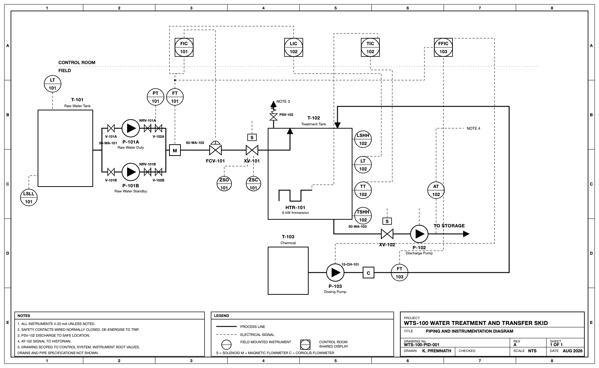
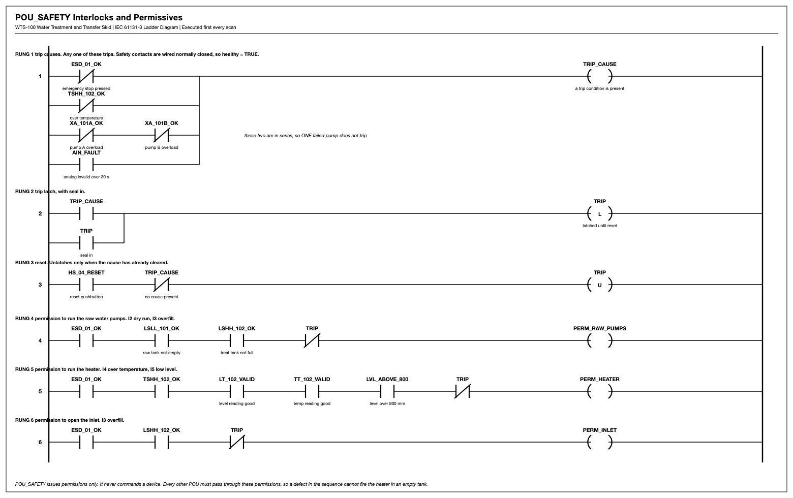

# WTS-100: PLC control system for a water treatment skid

I designed a control system for a small water treatment skid and then tested it.
It has the process documents, the PLC code, a simulated plant to run the code
against, and a factory acceptance test.

I built it the way a real job goes: write the narrative first, then the instrument
index and the I/O list, then the logic, then test it. Every number below comes from
a file in here, and both test suites run.

## The process

Water is pumped from a raw tank into a treatment tank by two pumps, one duty and
one standby. It is dosed with chemical, heated to setpoint, then pumped out. The
sequence is IDLE -> FILL -> HEAT -> DRAIN, and each step has a timeout.

## What's in it

    4 control loops    level LIC-102 cascaded to flow FIC-101, temperature TIC-102,
                       dosing ratio FFIC-103
    8 interlocks       I1 to I8, each with a cause, an action and a reset type
    12 alarms          ALM_001 to ALM_012, first out latching with acknowledge
    33 I/O signals     7 AI, 4 AO, 14 DI, 8 DO
    standards          ISA-5.1 for the P&ID, ISA-18.2 for alarms, IEC 61131-3

## The ladder

I drew the safety and pump logic as ladder, 28 rungs across two POUs.

The rungs are not just a picture. `tests/test_ladder.py` runs them scan by scan and
checks the behaviour with 26 tests. They all pass.

Two things here are easy to get wrong and I had to think about both:

- The seal in parallels the start contact only. Stop and the permissives stay in
  series after it. If the seal in wrapped the whole rung the pump would latch on
  and ignore the interlocks.
- The two pump overloads are in series, not parallel. One pump failing changes over
  to the standby. Only both failing trips the plant.

## Running it in OpenPLC

The logic is not only Python. I entered the safety block in OpenPLC as Structured
Text and ran it through the OpenPLC Simulator toolchain.

`plc/openplc/pou_safety.st` is the safety function block with the comment headers
stripped, so it pastes straight into the OpenPLC Editor. `plc/openplc/main.st` is a
small test program that instantiates it, wires the ten inputs, and exposes TRIP,
FIRST_OUT and the three permissions as variables you can watch in the debugger.

It starts with `ESD_01_OK := FALSE`, so on the first scan it should trip with all
three permissions false and FIRST_OUT = 1. Set `ESD_01_OK` true, pulse
`HS_04_RESET`, and the trip clears.

## Testing

    python3 tests/test_ladder.py     26 logic tests on the safety and pump logic
    cd sim && python3 fat.py         14 FAT cases against the simulated plant

Right now that is 26 of 26 and 14 of 14 passing.

The FAT is the part I like. Each case starts from a healthy running plant, breaks
one thing, and checks the controller does the right thing. It covers the e-stop
(trip latches, stays latched after the cause clears, resets only once the cause is
gone), the low low and high high level interlocks, changeover to the standby pump on
one fault versus tripping when both fail, over temperature, a broken transmitter,
blocked discharge, and a frozen transmitter that should raise an alarm but should
NOT trip, because a steady process can also read steady.

Expected against actual for every case is in [docs/04_FAT_results.md](docs/04_FAT_results.md).

## Files

    docs/          control narrative, instrument index, signal scaling, FAT results
    drawings/      P&ID, ladder diagrams, sequence diagram
    plc/           Structured Text POUs, and the OpenPLC versions
    sim/           simulated plant, controller, HMI, historian, the FAT
    tests/         ladder logic tests
    tools/         the scripts that draw the diagrams and make the PDFs
    pdf/           the documents as PDFs

## Running the simulation

Needs Python 3.9 or newer.

    pip install -r requirements.txt

Then three things in three terminals, the plant, the controller and the HMI. The
steps are in [sim/HOW_TO_RUN.md](sim/HOW_TO_RUN.md). The historian writes a CSV of
every scan and there is an example run in `sim/batch_log_example.csv`.

## What's missing / next

- The plant is simulated, not real hardware. The models are first order with dead
  time, so they are not a validated plant model.
- I have entered the logic in OpenPLC as Structured Text, not as ladder. Entering
  the 28 rungs as an LD program and checking they behave the same is the next thing
  I want to do.
- This is not a rated safety system. The e-stop and the over temperature trip are
  also wired through hardware contactors in the narrative, because the PLC should
  not be the last line of defence. There is no SIL rating and no hazard study.

Karishma Premnath
